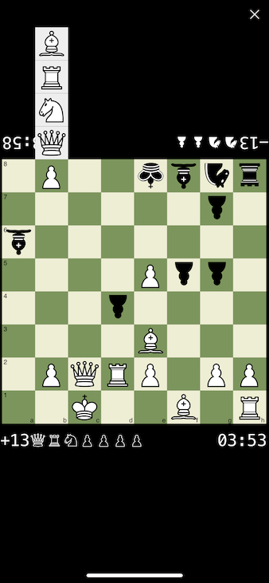
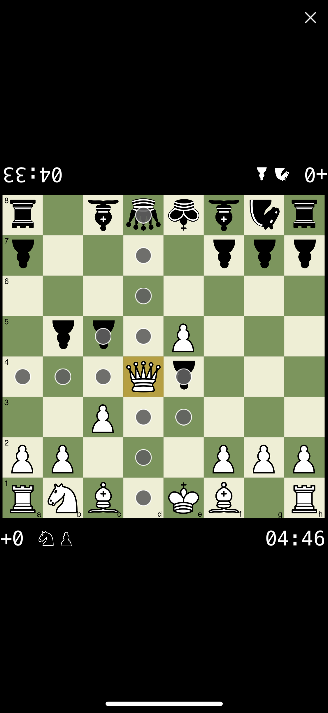
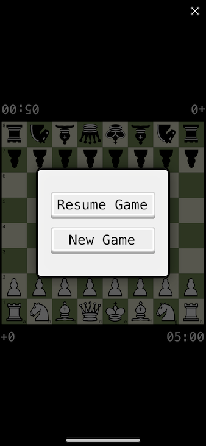

# pychess

This is a full featured chess game for iOS, developed entirely on an iPhone X
using the [Pythonista app](http://omz-software.com/pythonista/),
which enables doing Python development on iOS.
I developed this game during a two week period on a vacation in Chile.
The game can only be run at the moment through the Pythonista app,
since it uses two iOS specific Python modules that only it provides.

The game implements chess move and capture rules perfectly,
including pawn promotion, castling, en passant, and checking logic.
It also supports full saving and resuming a game through the use of Python's `pickle` module.
The game has been tested and runs perfectly on iPhone X and on iPad Air.

Challenges of developing on an iPhone:
- Pythonista doesn't support `mypy` or any kind of Python type checking
- Pythonista only supports Python 3.6.1, so that had be used
- Pythonista had some import issues, which made using a nested file structure impossible.
- The same import issues also prevented the use of `unittest` and `pytest`,
  so the tests had to be done without them.
- Couldn't use Git or any other version control
- The keyboard was suboptimal

Things that were done outside of iOS:
- Running Pycharm's type checking and linting, and cleaning the errors.
- Creating this README
- Creating the Git repo and pushing to GitHub

#### How to run the project:
- The text based game, `main_tui.py` and the unit tests in `tests.py` can be run anywhere with Python
  with no external dependencies.
- The iOS GUI game `main_gui.py` can be run by installing Pythonista on an iOS device
  and importing the project files to it.
 
#### In-game screenshots

